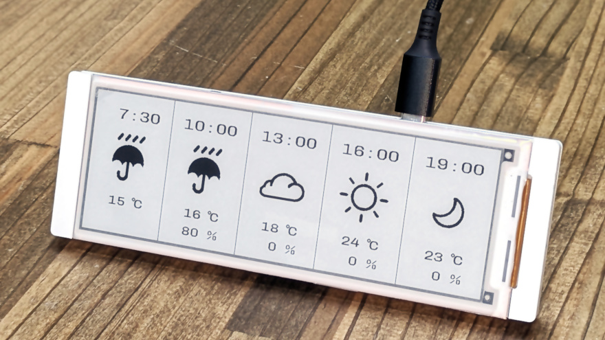
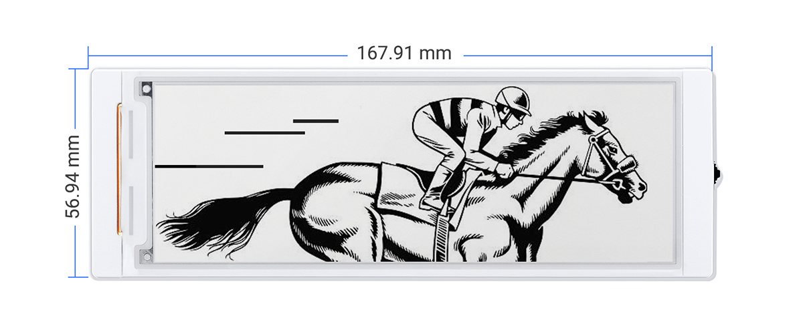
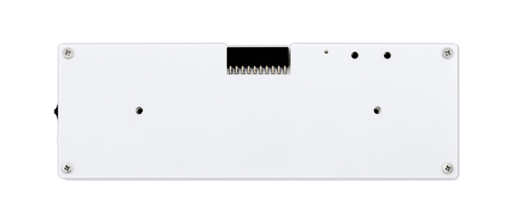
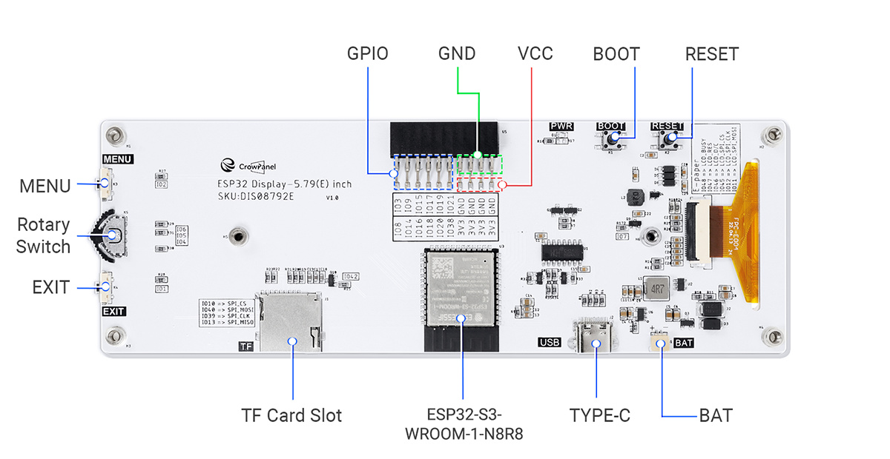

# Table of Contents / 目次

- [Overview / 概要](#overview--概要)
- [Photos / 写真](#photos--写真)
- [Why I Made This / 開発のきっかけ](#why-i-made-this--開発のきっかけ)
- [How the System Works / 動作概要](#how-the-system-works--動作概要)
- [Hardware / ハードウェア構成](#hardware--ハードウェア構成)
- [Before You Start / 事前準備](#before-you-start--事前準備)
- [Installation / インストール方法](#installation--インストール方法)
- [Credits / クレジット](#credits--クレジット)
- [Disclaimer / 免責事項](#disclaimer--免責事項)
- [License / ライセンス](#license--ライセンス)

# Overview / 概要

This project is a weather forecast display system that uses [Elecrow's CrowPanel ESP32 E-Paper HMI 5.79-inch Display](https://www.elecrow.com/crowpanel-esp32-5-79-e-paper-hmi-display-with-272-792-resolution-black-white-color-driven-by-spi-interface.html). It displays weather forecast at 3-hour intervals for the next 12 hours.
The weather forecast data is retrieved via [OpenWeatherMap](https://openweathermap.org/) API.

\[日本語\]

このプロジェクトは、天気予報表示システムです。12時間後までの3時間ごとの天気予報を表示します。
ハードウェアは [ElecrowのCrowPanel ESP32 E-Paper HMI 5.79-inch Display](https://www.elecrow.com/crowpanel-esp32-5-79-e-paper-hmi-display-with-272-792-resolution-black-white-color-driven-by-spi-interface.html) を使っています。
天気予報データは、[OpenWeatherMap](https://openweathermap.org/) APIにて取得します。

# Photos / 写真



# Why I Made This / 開発のきっかけ

I developed this weather forecast display system for my young children.
While adults can easily check the weather on their smartphones each morning and dress or plan accordingly, young children typically do not have access to such tools.
To address this, I created a weather display system that children can check on their own.
By using an E-Paper display, the system becomes not only easy to read but also energy efficient.

\[日本語\]

この天気予報表示システムは、私の幼い子どもたちのために開発しました。
毎朝、大人はスマートフォンで簡単に天気を確認して、必要な準備ができますが、幼い子どもたちには通常そうした手段がありません。
そこで、子どもたちが自分で天気を確認できるようなシステムを作りました。
表示に電子ペーパーを使用することで、見やすいだけでなく省電力にもなっています。

# How the System Works / 動作概要

The system operates as follows:

1. Connects to a 2.4 GHz WiFi network on startup.
1. Retrieves the current weather and forecast (3, 6, 9, and 12 hours ahead) via [OpenWeatherMap](https://openweathermap.org/) API.
1. Displays weather information (time, weather condition, temperature, and probability of precipitation) on the E-Paper display.
1. Enters [Deep-sleep mode](https://docs.espressif.com/projects/esp-idf/en/stable/esp32/api-reference/system/sleep_modes.html) to save power.
1. Restarts after the configured interval (default: 1 hour).

\[日本語\]

システムは次のように動作します。

1. 起動時に2.4GHz WiFiに接続する。
1. [OpenWeatherMap](https://openweathermap.org/) APIを使って現在の天気と予報（3時間後、6時間後、9時間後、12時間後）を取得する。
1. 電子ペーパーに天気情報を表示する（時刻、天気、気温、降水確率）。
1. 省電力のために [ディープスリープモード](https://docs.espressif.com/projects/esp-idf/en/stable/esp32/api-reference/system/sleep_modes.html) に入る。
1. 設定された時間（デフォルト：1時間）後に再度起動する。

# Hardware / ハードウェア構成

- [Elecrow's CrowPanel ESP32 5.79-inch E-paper HMI Display](https://www.elecrow.com/crowpanel-esp32-5-79-e-paper-hmi-display-with-272-792-resolution-black-white-color-driven-by-spi-interface.html) :

    - A display module equipped with a 5.79-inch E-Paper display. The display has a resolution of 272(H) × 792(L) pixels.
    - Its main controller is [ESP32-S3-WROOM-1-N8R8](https://www.espressif.com/en/products/modules/esp32-s3). It is certified under FCC ID [2AC7Z-ESPS3WROOM1](https://fcc.report/FCC-ID/2AC7Z-ESPS3WROOM1), CE compliant under the RED directive, and is certified in Japan under TELEC No. [R 201-220052](https://www.tele.soumu.go.jp/giteki/SearchServlet?pageID=jk01&NUM_TYPE=1&NUM=201-220052&NAM=&FOM=&PC=&YAR_FROM=&MON_FROM=&DAY_FROM=&YAR_TO=&MON_TO=&DAY_TO=&RAD=00-00-00-00&TEC=1&TEC=2&TEC=3&TEC=4&TEC=5&TEC=6&TEC=7&DC=0&SC=1#searchlist).
    - It is housed in an acrylic enclosure.

\[日本語\]

- [ElecrowのCrowPanel ESP32 5.79-inch E-paper HMI Display](https://www.elecrow.com/crowpanel-esp32-5-79-e-paper-hmi-display-with-272-792-resolution-black-white-color-driven-by-spi-interface.html)
    - 5.79インチの電子ペーパーを搭載したディスプレイモジュールです。解像度は272(H)×792(L)ピクセル。
    - メインコントローラーは [ESP32-S3-WROOM-1-N8R8](https://www.espressif.com/en/products/modules/esp32-s3) です。FCC ID [2AC7Z-ESPS3WROOM1](https://fcc.report/FCC-ID/2AC7Z-ESPS3WROOM1) の認証を取得しており、RED指令に基づくCE適合、および日本の技術基準適合認証（技適/TELEC）番号 [R 201-220052](https://www.tele.soumu.go.jp/giteki/SearchServlet?pageID=jk01&NUM_TYPE=1&NUM=201-220052&NAM=&FOM=&PC=&YAR_FROM=&MON_FROM=&DAY_FROM=&YAR_TO=&MON_TO=&DAY_TO=&RAD=00-00-00-00&TEC=1&TEC=2&TEC=3&TEC=4&TEC=5&TEC=6&TEC=7&DC=0&SC=1#searchlist) を取得しています。
    - アクリル板製のエンクロージャーに収められています。







# Before You Start / 事前準備

To get weather forecast data, you need an API key from [OpenWeatherMap](https://openweathermap.org/).
This system uses [One Call API 3.0](https://openweathermap.org/api/one-call-3), which requires registering a credit card, along with your address and phone number.
[This API is free for up to 1,000 calls per day; beyond that, a charge of £0.12 is incurred for each additional 100 calls](https://openweathermap.org/price).

**IMPORTANT**: To avoid unexpected charges, be sure to follow step 16 below to set your daily request limit to 900. This should allow you to use the service free of charge. If you exceed the daily limit, you'll get an HTTP 429 response status code. (see the [FAQ](https://openweathermap.org/faq) `I'm worried that I might accidentally make too many calls and be charged for them. How can I limit API calls?`).

1. Open the [OpenWeatherMap website](https://openweathermap.org/).

1. Click "Sign in" at the top right corner.

1. Click "Create an Account".

1. Enter your username, email address, and password. Then, check the following boxes:

   - "I am 16 years old and over"
   - "I agree with Privacy Policy, Terms and conditions of sale and Websites terms and conditions of use"
   - "I am not a robot"

    Finally, click the "Create Account" button.

1. A dialog titled "How and where will you use our API?" will appear.

1. If you are registering as an individual, leave the "Company" field blank.
   Select the appropriate purpose in the "Purpose" field and click the "Save" button.

1. You will receive an email from "Open Weather Team" with the subject "OpenWeatherMap Account confirmation."

1. Click the "Verify your email" button in the email.

1. Sign in using your registered email address and password.

1. Click the "API keys" tab.

1. Note down your API key.

1. Click the "Billing plans" tab.

1. Under the "One Call API 3.0" section, click the "Subscribe" button next to the "Base plan."

1. Enter your billing information (First name, Last name, Country, Address Line 1, Address Line 2, City, Postal code, and Phone) and click the "Continue to payment" button.

1. Enter your credit card information (through [Stripe](https://stripe.com)).

1. To avoid unexpected charges, click the pencil icon beside the "Calls per day (no more than)" field and set the value to less than 1,000 (I set it to 900).

\[日本語\]

天気予報情報を取得するために、 [OpenWeatherMap](https://openweathermap.org/) のAPIキーが必要です。
本システムでは [One Call API 3.0](https://openweathermap.org/api/one-call-3) を使用するため、クレジットカードと住所・電話番号を登録する必要があります。
[このAPIは、1日1000回までは無料ですが、それを超えた場合、100回毎に0.12ポンドの料金が発生します。](https://openweathermap.org/price) 

**重要**: 意図せず費用を請求されることを防ぐために、以下の手順16に従って、1日あたりのリクエスト制限を900に設定してください。これにより、サービスの無料での利用が可能と考えています。1日あたりの制限を超えた場合は、HTTP 429 レスポンスステータスコードが返されます（ [FAQ](https://openweathermap.org/faq) の `I'm worried that I might accidentally make too many calls and be charged for them. How can I limit API calls?`を参照のこと）。

1. [OpenWeatherMapの公式サイト](https://openweathermap.org/) を開きます。

1. 右上の「Sign in」をクリックします。

1. 「Create an Account」をクリックします。

1. ユーザー名、メールアドレス、パスワードを入力し、以下のチェックボックスを有効化します。

   - 「I am 16 years old and over」
   - 「I agree with Privacy Policy, Terms and conditions of sale and Websites terms and conditions of use」
   - 「私はロボットではありません」

    「Create Account」ボタンをクリックします。

1. 「How and where will you use our API?」というダイアログが表示されます。

1. 個人であれば、「Company」欄は空欄のままにします。「Purpose」欄で適切な利用目的を選択し、「Save」ボタンをクリックします。

1. 「Open Weather Team」から「OpenWeatherMap Account confirmation」という件名のメールが届きます。

1. メール内の「Verify your email」ボタンをクリックします。

1. 登録したメールアドレスとパスワードでサインインします。

1. 「API keys」タブをクリックします。

1. APIキーをメモしておきます。

1. 「Billing plans」タブをクリックします。

1. 「One Call API 3.0」パートの「Base plan」の「Subscribe」ボタンをクリックします。

1. 請求情報（「First name」、「Last name」、「Country」、「Address Line 1」、「Address Line 2」、「City」、「Postal code」、「Phone」）を入力し、「Continue to payment」ボタンをクリックします。

1. クレジットカード情報を入力します（ [Stripe](https://stripe.com) 経由です）。

1. 意図せず費用を請求されることを防ぐために、「Calls per day (no more than)」欄の鉛筆アイコンをクリックし、値を1000未満に設定します（私は900に設定しました）。

# Installation / インストール方法

1. Clone the repository:
    ```sh
    git clone https://github.com/cubic9com/crowpanel-5.79_weather-display.git
    cd crowpanel-5.79_weather-display
    ```

1. Install [Visual Studio Code](https://code.visualstudio.com/) if you haven't already.

1. Open the project using Visual Studio Code:
    ```sh
    code .
    ```

1. Install `PlatformIO IDE` extension:
    - Go to the Extensions view (`Ctrl+Shift+X`).
    - Search for `PlatformIO IDE` and install it.

1. Open PlatformIO Home:
    - In the left Activity Bar, click PlatformIO icon.
    - In the left Primary Sidebar, go to `QUICK ACCESS > PIO Home > Open`.

1. Open the project:
    - In the right Editor Group, click `Open Project` in the `PIO HOME` tab.
    - Select the cloned `crowpanel-5.79_weather-display` project folder.

1. Find the `config.template.h` file. Make a copy of it and rename the copy to `config.h`.

1. Open this new `config.h` file and modify the following lines with your own details:
    ```cpp
    // 2.4 GHz WiFi Configurations
    #define WIFI_SSID "your WiFi SSID"
    #define WIFI_PASSWORD "your WiFi password"

    // OpenWeatherMap API Configurations
    #define OPENWEATHERMAP_API_KEY "your OpenWeatherMap API key"
    #define LATITUDE 35.68130      // Latitude (e.g., Tokyo)
    #define LONGITUDE 139.76707    // Longitude (e.g., Tokyo)
    #define TIMEZONE_OFFSET 9      // Offset from UTC (in hours)

    // Interval Configurations (minutes)
    #define INTERVAL_IN_MINUTES 60 // 1 hour
    ```
    
    Note: You can get the latitude and longitude from the URL after searching for your desired location in [Google Maps](https://www.google.com/maps/).


1. Build and upload the project:
    - In the PlatformIO sidebar, go to `PROJECT TASKS > esp32-s3-devkit-1 > General > Upload`.

\[日本語\]

1. リポジトリをクローンします:
    ```sh
    git clone https://github.com/cubic9com/crowpanel-5.79_weather-display.git
    cd crowpanel-5.79_weather-display
    ```

1. まだインストールしていない場合は、[Visual Studio Code](https://code.visualstudio.com/) をインストールします。

1. Visual Studio Code でプロジェクトを開きます:
    ```sh
    code .
    ```

1. `PlatformIO IDE` 拡張機能をインストールします:
    - 左サイドバーの「拡張機能」ビュー (`Ctrl+Shift+X`) を開きます。
    - `PlatformIO IDE` を検索してインストールします。

1. PlatformIO Home を開きます:
    - 左のアクティビティバーで PlatformIO アイコンをクリックします。
    - 左のメインサイドバーから `QUICK ACCESS > PIO Home > Open` を選択します。

1. プロジェクトを開きます:
    - 右のエディターグループ内の `PIO HOME` タブで `Open Project` をクリックします。
    - クローンした `crowpanel-5.79_weather-display` プロジェクトフォルダーを選択します。

1. `config.template.h` ファイルを見つけます。コピーを作成し、名前を `config.h` に変更します。

1. この新しい `config.h` ファイルを開き、以下の行を必要に応じて変更します。
    ```cpp
    // 2.4 GHz WiFi設定
    #define WIFI_SSID "あなたのWiFi SSID"
    #define WIFI_PASSWORD "あなたのWiFiパスワード"

    // OpenWeatherMap API設定
    #define OPENWEATHERMAP_API_KEY "あなたのOpenWeatherMap APIキー"
    #define LATITUDE 35.68130      // 緯度（例：東京）
    #define LONGITUDE 139.76707    // 経度（例：東京）
    #define TIMEZONE_OFFSET 9      // UTCからのオフセット（時間）

    // 更新間隔設定（分）
    #define INTERVAL_IN_MINUTES 60  // 1時間
    ```

    なお、緯度と経度は [Googleマップ](https://www.google.com/maps/) で天気予報を表示したい地点を検索した後のURLから取得できます。

1. プロジェクトをビルド＆アップロードします:
    - PlatformIOのサイドバーで `PROJECT TASKS > esp32-s3-devkit-1 > General > Upload` を選択します。

# Credits / クレジット

- This program was developed based on the [Arduino demo for Elecrow's CrowPanel ESP32 E-Paper HMI 5.79-inch Display](https://github.com/Elecrow-RD/CrowPanel-ESP32-5.79-E-paper-HMI-Display-with-272-792/tree/master/example/arduino/Demos/5.79_wifi_http_openweather).
- Weather data provided by [OpenWeather](https://openweathermap.org/).
- The weather icons are from [Easy Weather Icons Font set by boxbot6](https://github.com/boxbot6/easy-weather-icons-font), licensed under the MIT License.
- The font is [Chivo Mono by Omnibus-Type](https://fonts.google.com/specimen/Chivo+Mono), licensed under the SIL Open Font License, Version 1.1.

\[日本語\]

- このプログラムは、 [ElecrowのCrowPanel ESP32 E-Paper HMI 5.79-inch DisplayのArduino用デモプログラム](https://github.com/Elecrow-RD/CrowPanel-ESP32-5.79-E-paper-HMI-Display-with-272-792/tree/master/example/arduino/Demos/5.79_wifi_http_openweather) をベースに開発しました。
- 天気予報情報は [OpenWeather](https://openweathermap.org/) によって提供されたものです。
- 天気アイコンは [boxbot6様のEasy Weather Icons Font set](https://github.com/boxbot6/easy-weather-icons-font) を、MITライセンスの下で使用しています。
- フォントは [Omnibus-Type様のChivo Mono](https://fonts.google.com/specimen/Chivo+Mono) を、SIL Open Font License, Version 1.1の下で使用しています。

# Disclaimer / 免責事項

This project is provided for educational and personal use only. The author makes no guarantees regarding the accuracy, reliability, or continued availability of the system or any third-party services it depends on.

Use this project at your own risk. The author shall not be held liable for any damage, data loss, costs, or consequences arising from the use of this software, including but not limited to:

* Misuse or misconfiguration of the system
* API limitations or changes (e.g., from [OpenWeatherMap](https://openweathermap.org/))
* Hardware malfunctions
* Network failures

By using this project, you agree to assume full responsibility for any and all outcomes.

\[日本語\]

本プロジェクトは、教育目的および個人利用を想定して提供しています。システムおよび依存する外部サービスの正確性、信頼性、継続的な提供について、作者は一切の保証を行いません。

本ソフトウェアの使用は自己責任でおこなってください。著者は、以下を含む本ソフトウェアの使用により生じたいかなる損害、データの損失、費用、その他の結果についても責任を負いません：

* システムの誤使用や設定ミス
* [OpenWeatherMap](https://openweathermap.org/) など外部APIの制限や仕様変更
* ハードウェアの不具合
* ネットワークの障害

本プロジェクトを利用することで、すべてのリスクと結果に対する責任をユーザー自身が負うことに同意したものとみなされます。

# Related Projects / 関連プロジェクト

- [FontGen4LCDandEPD](https://github.com/cubic9com/FontGen4LCDandEPD): A lightweight Python script that converts TrueType fonts into C-style byte array for use on LCD and EPD (e-paper) modules in embedded systems. It is intended as a simplified alternative to PCtoLCD2002.

\[日本語\]

- [FontGen4LCDandEPD](https://github.com/cubic9com/FontGen4LCDandEPD): TrueTypeフォントを1ビットモノクロのビットマップフォントに変換し、 C言語形式のバイト配列として出力する軽量なPythonスクリプト。 LCDや EPD（電子ペーパー）などの組み込み機器での利用を想定しています。PCtoLCD2002の代替として使用できる（機能は単純化）。

# License / ライセンス

Copyright (C) 2025, cubic9com All rights reserved.

This project is licensed under the MIT license.

See the `LICENSE` file for details.
